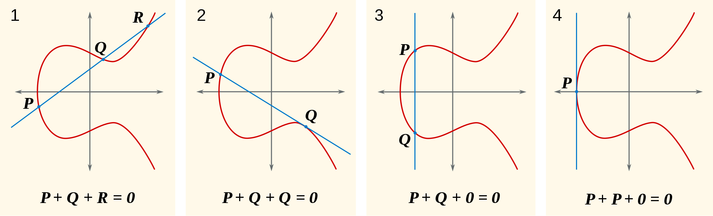

# Senior Thesis of Elliptic Curves
## Math Review
### Definition
An elliptic curve is a plane curve defined by the equation y2 = f(x) = x3 + ax + b (a,b ∈ K), where f(x) is a cubic polynomial with no repeated roots (4a3 + 27b2 ≠ 0).

### Singularity
Take the definition as F(x,y) = 0, then a point (x,y) is non-singular (or a smooth point) if ∂F/∂x or ∂F/∂y ≠ 0.  
In this way, with the cubic (x3), no multiple roots == all points are non-singular.

### Field of characteristic 2
The simplest field with characteristic 2 is F2 = Z/2Z -> 1 + 1 (2 times) ≡ 0 (mod 2).  
More generally, for every n ≥ 1, there is exactly one field of cardinality 2n up to isomorphism, denoted F2n. Like all fields of characteristic 2, these fields contain F2 as a subfield.  
Given any field K of characteristic 2, the algebraic closure of K also has characteristic 2. For example, the algebraic closure of F2 can be considered the union of all the fields F2n.  

### Elliptic curves with char(K) = 2 or 3 are INSECURE
#### Not secure
As 4a3 + 27b2 = 22a3 + 33b2, so with char(K) = 2 or 3, 4a3 + 27b2 = 0 always holds, and so the previous definition of elliptic curves is violated.  
There is no known subexponential-cost algorithm for computing discrete logs in elliptic curves over fields of small characteristic.
#### Further generalization
If we use a more general definition: **y2 + a1xy + a3y = x3 + a2x2 + a4x + a6**, then char(K) = 2 or 3 is no longer a problem.  
More explicitly, char(K) = 2 gets y2 + y = x3 + ax + b (together with O); char(K) = 3 gets y2 = x3 + ax2 + bx + c (together with O).

### Characteristic
#### Calculation
* O (infinity -- infinitely far up the y-axis) is taken as "zero element" (identity), -O = O, O + P = P
* -(x,y) = (x,-y)
* P + Q = -R (when P = Q, R is the only other point of intersection of *l* with the curve, and R could be O if *l* has double-tangency)

    

#### Over Real
##### Abelian
The set of points on an elliptic curve forms an abelian group (P + Q = Q + P).
##### Projective plane
For triples (X,Y,Z) (not all components 0),
* projective point: (λX,λY,λZ) ~ (X,Y,Z) for scalar λ, which forms an equivalence class
* when Z ≠ 0, we can find one and only one (x,y,1) from the equivalence class -> x = X/Z, y = Y/Z
* projective plane: all points (x,y) and *line at infinity* (points with Z = 0)

When more than one components on the triple (X,Y,Z) are 0, then we find the point O.
#### Over Complex
##### Lattice: L = Zω1 + Zω2
##### Weierstrass ℘-function ℘L(z) -- P155
#### Over Rational -- P156
##### Hasse's Theorem -- P158
#### Extensions of finite fields and the Weil conjectures -- P158

## Cryptosystems
### Multiple of points
kP ∈ E can be found in O(logk log3q) bit operations by repeated doubling
* this is not always the best, like when p = 2 (char(K) = 2)
* if we know NP = 0 and k > N, then use k ≡ k mod N, and the time estimate becomes O(log4q) as N < q + 1 + 2√q = O(q)

### Imbedding plaintexts
* Encoding is not the same as Encryption.
* There is no polynomial time deterministic algorithm known for writing down a large number of points on an arbitrary E.
* There are probabilistic algorithms for which the chance of failure is very small.
* In order to encode a large number of possible messages *m*, we need a systematic way to generate points that are related to *m* in some way (like the x-coordinate has a simple relationship to the integer *m*).

### Discrete log on E
#### Discrete Log Problem
* Influence: upon it, we build the key-exchange protocols, the digital-signature schemes, and the public-key encryption systems
* Definition: with a finite cyclic group G = {g, g2, g3, ...} of prime order N, given (g, gx) ∈ G2, for an x sampled uniformly at random from ZN, find x ∈ ZN
* Hardness: depend crucially on the choice of the group G
  * for the additive group of integers modulo N, it could be solved in polynomial time
  * for the multiplicative group of integers modulo N, the best known algorithm takes sub-exponential time
  * for elliptic-curve groups (that your laptop uses to talk to your mail server), the best known algorithm requires exponential time O(N1/2)
#### Extension to E
* Definition: if E is an elliptic curve over F<sun>q and B is a point of E, then the discrete log problem on E (to the base B) is: given a point P ∈ E, of finding an integer x ∈ Z such that xB = P if such an integer x exists
* It seems that the analogous systems using elliptic curves defined over F2r will be secure with significantly smaller values of r
* Practical reasons (relating to both hardware and software) prefer to do arithmetic over F2r
  * it might be more convenient in applications than based on Discrete Log Problem in Fq*

### Diffie-Hellman
1. Public: finite field Fq and elliptic curve E
2. Private Key:  
    1. choose an arbitrary base point P ∈ E (where P.x ∈ Fq)
    2. A chooses a random integer a, gets aP ∈ E, send aP to B
    3. B chooses a random integer b, gets bP ∈ E, send bP to A
    4. both A and B have abP -- there seems no way to get abP only by aP and bP

### Massey-Omura
1. Public: imbed message *m* as points Pm on public elliptic curve E over Fq (q is very large), **the number of points on E is N**
2. Process:
    1. A chooses eA ∈ [1,N] that gcd(eA,N) = 1
        1. gets dA by Euclidean algorithm as dA = eA-1 (dAeA ≡ 1 mod N)
        2. sends eAPm
    2. B chooses eB ∈ [1,N] that gcd(eB,N) = 1
        1. gets dB by Euclidean algorithm as dB = eB-1 (dBeB ≡ 1 mod N)
        2. sends eAeBPm
    3. A multiplies dA and sends dAeAeBPm ≡ N * eBPm ≡ eBPm mod N
    4. B multiplies dB and gets dBeBPm ≡ N * Pm ≡ Pm mod N

### El Gamal
1. Public:
    1. finite field Fq, elliptic curve E and base point P ∈ E
    2. A chooses a secret integer aA and **publishes aAP**
    3. B chooses a secret integer aB and **publishes aBP**
2. Process:
    1. A chooses a random integer k, sends (kP, Pm + k(aBP))
    2. B multiplies kP by aB, then decreases by Pm + k(aBP as Pm + k(aBP) - aB(kP) = Pm
3. kP is the "clue", and kaBP is the "mask"

### Choice of elliptic curve E and base point P
#### Randomly choose E and P with large finite field Fq
1. let x,y,a ∈ Fq
2. set b = y2 - (x3 + ax)
3. make sure x3 + ax + b doesn't have multiple roots -> equivalent to 4a3 + 27b2 ≠ 0
4. set P = (x,y) and E: y2 = x3 + ax + b
5. to ensure the security, N needs to have very large prime factors (though it's not necessarily needed in Diffie-Hellman and El Gamal)
#### Reducing a global (E,P) mod p
1. choose "once and for all" a "global" elliptic curve and a point of infinite order on it
2. let E be defined over the field of rational numbers
3. let P be a point of infinite order on E
    1. for example -- P = (0,0), E: y2 + y = x3 - x
    2. for example -- P = (0,0), E: y2 + y = x3 + x2
4. choose a large prime p
5. get E mod p over Fp and P mod p
    * for E mod p being of prime order N for large p, E must have trivial torsion (no points except O of finite order) -> otherwise, N will be divisible by the order of the torsion subgroup
#### Order of P
1. divisible by a very large prime == having order of magnitude almost as large as N
2. guarantee P is suitable -- choose E and Fq so that N is prime -> every P ≠ O will be a generator

## Questions
1. P163 - one possible probabilistic method -> why 30 to 50 are enough?
2. P164 - Diffie-Hellman, "converted to a random r-digit base-p integer" -> how long it takes to process this?
